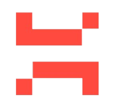

<p align="center">
  
</p>

<h1 align="center">Osama Mumtaz — Personal Portfolio</h1>

<p align="center">
  <b>An immersive 3D developer portfolio built with React, Three.js, and Framer Motion</b>
</p>

<p align="center">
  
  
  
  
  
</p>

---

## 🚀 Overview

A modern, interactive developer portfolio that showcases my professional journey, technical skills, and featured projects. The site features **immersive 3D models**, **smooth scroll-triggered animations**, and a **functional contact form** — all wrapped in a sleek dark theme designed to leave a lasting impression.

---

## ✨ Key Features

| Feature | Description |
|---|---|
| **3D Hero Scene** | Interactive rotating 3D desktop PC model rendered with React Three Fiber & Drei |
| **3D Earth Model** | Animated Earth globe in the contact section with orbital camera controls |
| **Star Field Background** | Randomly generated star particles creating an immersive space atmosphere |
| **Scroll Animations** | Smooth, staggered entrance animations powered by Framer Motion |
| **GSAP Animations** | High-performance timeline-based animations using GSAP |
| **Interactive Tech Balls** | 3D technology icon spheres that users can rotate and interact with |
| **Contact Form** | Fully functional email form integrated with EmailJS |
| **Responsive Design** | Optimized layout across all breakpoints (mobile, tablet, desktop) |
| **Tilt Effects** | Parallax card tilt effects on hover using `react-tilt` |
| **Vertical Timeline** | Professional experience displayed in an elegant vertical timeline |

---

## 📂 Project Structure

```
Osama-Mumtaz-Portfolio/
├── public/
│   ├── desktop_pc/          # 3D Desktop PC model (GLTF)
│   └── planet/              # 3D Earth model (GLTF)
├── src/
│   ├── assets/              # Images, icons, and static media
│   ├── components/
│   │   ├── canvas/
│   │   │   ├── Computers.jsx   # 3D Desktop PC canvas
│   │   │   ├── Earth.jsx       # 3D Earth globe canvas
│   │   │   └── Stars.jsx       # Star particle field
│   │   ├── Hero.jsx            # Hero section with intro text
│   │   ├── About.jsx           # About me + service cards
│   │   ├── Experience.jsx      # Work experience timeline
│   │   ├── Tech.jsx            # Technology stack showcase
│   │   ├── Works.jsx           # Featured projects gallery
│   │   ├── Feedbacks.jsx       # Client testimonials
│   │   ├── Contact.jsx         # Contact form with 3D Earth
│   │   ├── Navbar.jsx          # Navigation bar
│   │   ├── Footer.jsx          # Footer section
│   │   └── Loader.jsx          # Loading spinner for 3D models
│   ├── constants/
│   │   └── index.js            # All site data (services, experiences, projects, etc.)
│   ├── hoc/
│   │   └── SectionWrapper.jsx  # Higher-Order Component for consistent section layout
│   ├── utils/
│   │   └── motion.js           # Framer Motion animation variants
│   ├── App.jsx                 # Root component with section composition
│   ├── main.jsx                # Entry point
│   ├── styles.js               # Reusable Tailwind class utilities
│   └── index.css               # Global styles and custom CSS
├── index.html                  # HTML entry point
├── tailwind.config.cjs         # Tailwind CSS configuration
├── postcss.config.cjs          # PostCSS configuration
├── vite.config.js              # Vite build configuration
└── package.json                # Dependencies and scripts
```

---

## 🛠️ Tech Stack

### Core
- **React 18** — UI library with functional components & hooks
- **Vite 4** — Lightning-fast build tool and dev server
- **React Router DOM** — Client-side routing

### 3D & Visuals
- **Three.js** — 3D rendering engine
- **React Three Fiber** — React renderer for Three.js
- **@react-three/drei** — Useful helpers for R3F (OrbitControls, models, etc.)
- **maath** — Math utilities for 3D computations

### Animations
- **Framer Motion** — Declarative scroll & layout animations
- **GSAP** — Performance-grade timeline animations
- **react-tilt / vanilla-tilt** — 3D parallax hover effects

### Styling
- **Tailwind CSS 3** — Utility-first CSS framework
- **PostCSS + Autoprefixer** — CSS processing pipeline

### Integrations
- **EmailJS** — Send emails directly from the contact form (no backend needed)
- **React Icons** — Icon library with popular icon packs
- **Heroicons** — Beautiful hand-crafted SVG icons

---

## 📋 Sections

1. **Hero** — Animated introduction with name, title, and a 3D desktop computer model
2. **About** — Summary of expertise with animated service cards (TPM, Sr. Engineer, Android Dev, Backend & DevOps)
3. **Experience** — Career timeline from Web Developer Intern → Jr. Android Dev → Android Dev → Team Lead → Technical Product Manager
4. **Tech** — Interactive 3D ball grid showcasing proficiency in Kotlin, Java, Python, JavaScript, Django, Firebase, PostgreSQL, Docker, and more
5. **Projects** — Featured work including:
   - 🌐 **SnapLingo** — AI-powered cross-platform language learning app (Compose Multiplatform)
   - 🎨 **Live Wallpapers 4K** — AI wallpaper generator with HD/4K/3D library ([Play Store](https://play.google.com/store/apps/details?id=com.wallpaperapp.hdwallpapers.livewallpaperfree.coolwallpapers))
   - 📄 **PDF Scanner** — Camera-based document scanner app ([Play Store](https://play.google.com/store/apps/details?id=com.docscan.camscan.pdfscanner.pagescanner.documentscanner))
6. **Testimonials** — Client feedback and endorsements
7. **Contact** — Functional email form alongside a rotating 3D Earth globe

---

## ⚡ Getting Started

### Prerequisites

- **Node.js** ≥ 16
- **npm** or **yarn**

### Installation

```bash
# Clone the repository
git clone https://github.com/osama1malik/Osama-Mumtaz-Portfolio.git

# Navigate to the project
cd Osama-Mumtaz-Portfolio

# Install dependencies
npm install
```

### Development

```bash
# Start the dev server
npm run dev
```

The app will be available at `http://localhost:5173`

### Production Build

```bash
# Create optimized build
npm run build

# Preview production build
npm run preview
```

---

## 🎨 Customization

All portfolio content is centralized in a single file for easy updates:

**`src/constants/index.js`** — Edit this file to update:
- Navigation links
- Services / roles
- Technology stack
- Work experience entries
- Projects showcase
- Client testimonials

---

## 📄 License

This project is open source and available for personal use and reference.

---

<p align="center">
  Built with ❤️ by <b>Osama Mumtaz</b>
</p>
